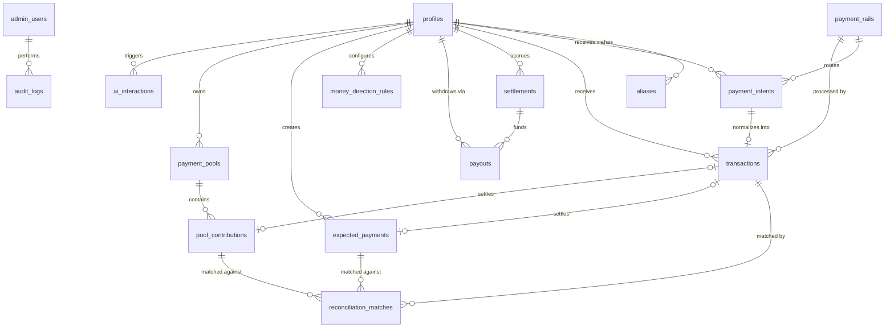

# UniPay — Database Schema Documentation

Phase 1 scope · PostgreSQL (Supabase) · Kenya / KES / LOOP

This document is the authoritative reference for every table in the UniPay
Phase 1 schema, including the `expected_payments` and pooled-payment tables
introduced in Build Prompt Phase 4B. It supplements — and must stay consistent
with — §11 (Data Model) of `UniPay_Technical_Documentation` and the phase
Definitions of Done in `UniPay_Build_Prompt.md`.

---

## 1. Conventions

These apply to every table unless a table explicitly says otherwise.

| Convention | Rule |
| --- | --- |
| Primary key | `id uuid primary key default gen_random_uuid()` |
| Timestamps | `timestamptz`, always UTC; every table has `created_at`, most have `updated_at` |
| Money | `numeric(14,2)` — never `float`/`double`; currency is always a sibling column, never assumed |
| Currency | `char(3)` ISO 4217, e.g. `'KES'` — Phase 1 is KES-only but the column is never hardcoded |
| Enums | Implemented as Postgres `check` constraints on `text`, not native `enum` types — keeps additive schema evolution painless (Handbook M8.3 discipline: every new allowed value is a constraint change, not a type migration) |
| Foreign keys | Always `references … on delete restrict` unless stated — Phase 1 never cascades a delete through money-related rows |
| Soft state, not deletion | Nothing money-related is ever hard-deleted; status columns represent lifecycle instead |
| Schema evolution | Every new column is optional with a sensible default; existing columns are never repurposed (§Phase 1, Handbook M8.3) |
| PII | Never logged in the clear; `id_number`, `id_document_url`, phone, and email are masked in logs and excluded from CSV export |

**Account model:** `profiles.account_type` is a flag (`individual` \| `business`), never a
schema fork. No table in this document has an individual-only or business-only variant —
conditional UI reads the same rows.

---

## 2. Entity-relationship overview



Text summary of the same relationships, for reference without a Mermaid renderer:

- `profiles` is the root of everything — one row per individual or business.
- `aliases` → `profiles` (many aliases can point at one profile, though Phase 1 issues one).
- `payment_intents` → `profiles` (recipient), normalizes into exactly one `transactions` row.
- `transactions` → `profiles`, `payment_intents`, `payment_rails`; optionally settles one
  `expected_payments` row or one `pool_contributions` row.
- `reconciliation_matches` → `transactions`, and optionally → `expected_payments` or
  `pool_contributions` depending on match source.
- `payment_pools` → `profiles` (owner); contains many `pool_contributions`.
- `settlements` → `profiles`; funds `payouts` via `money_direction_rules`.
- `admin_users` performs actions recorded in `audit_logs`.
- `ai_interactions` → `profiles`, logs every AI call regardless of which feature triggered it.

---

## 3. Core tables

### `profiles`

One row per individual or business. The single account model — no separate merchant table.

| Column | Type | Notes |
| --- | --- | --- |
| `id` | uuid | PK |
| `account_type` | text | `check in ('individual','business')` — a flag, not a fork |
| `display_name` | text | Shown to payers (e.g. "Amina Groceries") |
| `owner_name` | text | Legal/registered name of the account holder |
| `clerk_user_id` | text | FK to Clerk auth, unique |
| `phone` | text | Masked in logs |
| `email` | text | Masked in logs |
| `currency` | text | Default `'KES'` |
| `country_code` | text | Default `'KE'` |
| `status` | text | `check in ('active','suspended','closed')` |
| `verification_status` | text | `check in ('unsubmitted','submitted','ai_precheck_passed','ai_precheck_flagged','approved','rejected')` |
| `id_number` | text | National ID / passport number — masked in logs, excluded from CSV export |
| `id_document_url` | text | Masked in logs, excluded from CSV export |
| `id_submitted_at` | timestamptz | Nullable |
| `id_reviewed_at` | timestamptz | Nullable |
| `id_reviewer_note` | text | Admin/compliance note |
| `id_ai_check_result` | jsonb | AI pre-check output (§15) — a pre-check only, never a substitute for registry verification |
| `created_at` | timestamptz | |

**Indexes:** unique on `clerk_user_id`; btree on `verification_status` (Admin identity queue).

---

### `aliases`

| Column | Type | Notes |
| --- | --- | --- |
| `id` | uuid | PK |
| `profile_id` | uuid | FK → `profiles.id` |
| `alias` | text | Unique, e.g. `@amina` — gated on identity submission (§8) |
| `identifier_type` | text | `check in ('alias','qr','link')` |
| `is_verified` | boolean | Default `false` |
| `status` | text | `check in ('active','revoked')` |

**Indexes:** unique on `alias`.

---

### `payment_intents`

Created the moment a payer starts checkout, before any provider callback.

| Column | Type | Notes |
| --- | --- | --- |
| `id` | uuid | PK |
| `recipient_profile_id` | uuid | FK → `profiles.id` |
| `order_reference` | text | Free text or an `expected_payments.reference` / `pool_contributions` pointer — resolution happens at reconciliation time, not here |
| `amount` | numeric(14,2) | |
| `currency` | text | |
| `payer_phone` | text | Masked in logs |
| `payer_email` | text | Masked in logs |
| `provider` | text | e.g. `'loop'` |
| `rail` | text | FK-like reference to `payment_rails.adapter_key` |
| `status` | text | `check in ('created','pending','completed','expired','failed')` |
| `provider_reference` | text | Provider-side transaction/request ID |
| `idempotency_key` | text | Unique — required on every write to this table |
| `expires_at` | timestamptz | |
| `initiated_at` | timestamptz | |
| `completed_at` | timestamptz | Nullable |

**Indexes:** unique on `idempotency_key` (composite index planned in Phase 0 before volume
makes it painful).

---

### `transactions`

The single normalized shape every payment lands in, regardless of entry point or rail.

| Column | Type | Notes |
| --- | --- | --- |
| `id` | uuid | PK |
| `recipient_profile_id` | uuid | FK → `profiles.id` |
| `payment_intent_id` | uuid | FK → `payment_intents.id` |
| `provider` | text | |
| `rail` | text | |
| `internal_reference` | text | UniPay-generated |
| `external_reference` | text | Provider/payer-supplied — the field reconciliation fuzzy-matches on |
| `amount` | numeric(14,2) | Gross amount |
| `currency` | text | |
| `provider_fee` | numeric(14,2) | |
| `net_amount` | numeric(14,2) | `amount − provider_fee − platform_fee − tax` (§13) |
| `payer_identifier` | text | Phone/email/alias — masked in logs |
| `payment_status` | text | `check in ('initiated','successful','failed','reversed')` |
| `settlement_status` | text | `check in ('pending','settled','delayed')` — **always independent of `payment_status`**, never merged (§5, §12) |
| `refund_status` | text | `check in ('none','partial','full')` |
| `transaction_time` | timestamptz | |
| `settled_at` | timestamptz | Nullable |
| `ai_category` | text | Nullable — set by anomaly-flagging (§15 P1) |
| `raw_payload` | jsonb | Verbatim provider webhook/poll body, for audit |

**Indexes:** composite on `(recipient_profile_id, payment_status)` (Phase 0 indexing
discipline); btree on `settled_at` for reconciliation batch jobs.

**Settlement resolution:** a `transactions` row optionally resolves into exactly one of
`expected_payments` (via a match in `reconciliation_matches`) or one `pool_contributions`
row — never both. A transaction with no match against either stays a generic order match,
same as Phase 1 behavior before Phase 4B.

---

### `settlements`

| Column | Type | Notes |
| --- | --- | --- |
| `id` | uuid | PK |
| `profile_id` | uuid | FK → `profiles.id` |
| `provider` | text | |
| `settlement_reference` | text | |
| `currency` | text | |
| `gross_amount` | numeric(14,2) | |
| `fees` | numeric(14,2) | |
| `net_amount` | numeric(14,2) | |
| `status` | text | `check in ('pending','settled','failed')` |
| `expected_at` | timestamptz | |
| `settled_at` | timestamptz | Nullable |

Settlements represent money the provider confirms as settled into UniPay's/the user's
provider balance — distinct from `payouts`, which represents the user's own money actually
moving per their routing rule.

---

### `reconciliation_matches`

| Column | Type | Notes |
| --- | --- | --- |
| `id` | uuid | PK |
| `profile_id` | uuid | FK → `profiles.id` |
| `transaction_id` | uuid | FK → `transactions.id` |
| `match_source` | text | `check in ('order','expected_payment','pool_contribution')` — **added in Phase 4B**; `'order'` preserves original Phase 4 behavior |
| `expected_payment_id` | uuid | Nullable FK → `expected_payments.id` — set only when `match_source = 'expected_payment'` |
| `pool_contribution_id` | uuid | Nullable FK → `pool_contributions.id` — set only when `match_source = 'pool_contribution'` |
| `expected_reference` | text | Kept for `'order'`-source matches (pre-4B behavior) |
| `expected_amount` | numeric(14,2) | |
| `matched_amount` | numeric(14,2) | |
| `match_type` | text | `check in ('exact_reference','exact_amount_window','payer_amount','ai_fuzzy','manual')` — the five tiers in priority order (§14) |
| `confidence_score` | numeric(3,2) | 0.00–1.00 |
| `ai_explanation` | text | Plain-language explanation from `explainMatch()` (§15) — works identically across all three `match_source` values |
| `status` | text | `check in ('proposed','confirmed','rejected')` |
| `notes` | text | |

**Constraint:** exactly one of `expected_payment_id` / `pool_contribution_id` may be
non-null, and only when `match_source` matches — enforced at the application layer and, if
time allows, a Postgres `check` constraint.

**Indexes:** btree on `transaction_id`; btree on `(expected_payment_id)` and
`(pool_contribution_id)` for the Phase 4B match-tier lookups.

---

### `payouts`

| Column | Type | Notes |
| --- | --- | --- |
| `id` | uuid | PK |
| `profile_id` | uuid | FK → `profiles.id` |
| `provider` | text | |
| `requested_amount` | numeric(14,2) | |
| `requested_currency` | text | |
| `destination_type` | text | `check in ('loop_number','unipay_balance','bank')` |
| `destination_reference` | text | Masked in logs where applicable |
| `fee` | numeric(14,2) | |
| `net_amount` | numeric(14,2) | |
| `status` | text | `check in ('requested','processing','completed','failed')` |
| `provider_reference` | text | |
| `requested_at` | timestamptz | |
| `processed_at` | timestamptz | Nullable |
| `raw_payload` | jsonb | |
| `idempotency_key` | text | Unique — required so a retried "Withdraw" tap never double-disburses |

**Indexes:** unique on `idempotency_key`.

---

### `money_direction_rules`

| Column | Type | Notes |
| --- | --- | --- |
| `id` | uuid | PK |
| `profile_id` | uuid | FK → `profiles.id` |
| `destination_type` | text | `check in ('loop_number','unipay_balance','bank')` |
| `destination_reference` | text | |
| `allocation_type` | text | `check in ('full','percentage','fixed_amount')` |
| `allocation_value` | numeric(14,2) | Interpreted per `allocation_type` |
| `priority_order` | int | Multiple active rules apply in this order as funds settle |
| `is_active` | boolean | |
| `updated_at` | timestamptz | |

**Correctness rule:** a rule change takes effect on the **next** settlement only — it must
never retroactively touch already-routed funds. A pool's fully-collected total settles and
routes through these same rules exactly like any other settlement (Phase 4B, no separate
path).

---

### `payment_rails`

Config-driven rail/currency availability — a new row here, not a deploy, enables a rail.

| Column | Type | Notes |
| --- | --- | --- |
| `id` | uuid | PK |
| `name` | text | Display name |
| `adapter_key` | text | Unique — resolves to a `PaymentProviderAdapter` implementation |
| `is_enabled` | boolean | |
| `supported_currencies` | text[] | |
| `supported_countries` | text[] | |
| `min_amount` | numeric(14,2) | |
| `max_amount` | numeric(14,2) | |
| `capabilities_json` | jsonb | Mirrors the adapter's `capabilities()` output |

---

### `admin_users`

| Column | Type | Notes |
| --- | --- | --- |
| `id` | uuid | PK |
| `clerk_user_id` | text | Unique |
| `role` | text | `check in ('super_admin','support','compliance_reviewer')` |
| `permissions_json` | jsonb | |
| `created_at` | timestamptz | |

---

### `audit_logs`

| Column | Type | Notes |
| --- | --- | --- |
| `id` | uuid | PK |
| `actor_type` | text | `check in ('admin','system','user')` |
| `actor_id` | uuid | |
| `action` | text | |
| `target_type` | text | e.g. `'profile'`, `'payment_rails'`, `'expected_payment'` |
| `target_id` | uuid | |
| `before_state` | jsonb | |
| `after_state` | jsonb | |
| `created_at` | timestamptz | |

Every admin action that changes user-visible state writes here with before/after state,
enforced server-side (§16, §19) — never solely from the UI layer.

---

### `ai_interactions`

| Column | Type | Notes |
| --- | --- | --- |
| `id` | uuid | PK |
| `profile_id` | uuid | FK → `profiles.id` |
| `interaction_type` | text | `check in ('query','support','reconciliation','document_check','fraud_flag')` |
| `input_summary` | text | Never raw PII (§19) |
| `output_summary` | text | |
| `confidence_score` | numeric(3,2) | Nullable |
| `reviewed_by_human` | boolean | |
| `created_at` | timestamptz | |

Every AI call, regardless of feature, logs here — non-negotiable for anything touching
payments or identity (§15, §19).

---

## 4. Phase 4B tables — Expected & Pooled Payments

These extend the ledger and reconciliation engine already defined above. They introduce **no
new payment lifecycle, settlement path, or adapter work** — a transaction that resolves
against one of these tables still flows through the same `transactions` → `settlements` →
`payouts` pipeline as any other payment.

### `expected_payments`

Money a user is owed, tracked from the moment it's expected — not just recorded once it
lands.

| Column | Type | Notes |
| --- | --- | --- |
| `id` | uuid | PK |
| `owner_profile_id` | uuid | FK → `profiles.id` — the person/business owed the money |
| `payer_reference` | text | Optional — phone number, alias, or free-text name if the payer isn't yet a UniPay user |
| `amount` | numeric(14,2) | Total expected |
| `currency` | text | |
| `reference` | text | Description shown to the payer (e.g. "Order #4021") — this is what the reconciliation engine's exact-reference tier matches against |
| `due_at` | timestamptz | Nullable |
| `status` | text | `check in ('open','partially_paid','paid','overdue','cancelled')` |
| `amount_paid_to_date` | numeric(14,2) | Default `0` — accumulates across multiple matched transactions |
| `created_at` | timestamptz | |

**State machine:**

```
open ──(partial match)──> partially_paid ──(match completes amount)──> paid
open ──(due_at passes, still open/partially_paid)──> overdue
open / partially_paid ──(owner cancels)──> cancelled
```

**Constraints:**
- `amount_paid_to_date` must never silently exceed `amount` — an incoming match that would
  cause this is routed to the exception queue as an overpayment, not auto-applied.
- `status = 'overdue'` is a derived/scheduled state (a batch job flags it), not something a
  client sets directly.

**Indexes:** btree on `(owner_profile_id, status)`; btree on `reference` (matched against
`transactions.external_reference`).

---

### `payment_pools`

Money collected from a group toward one target — a chama round, a group order, a shared
bill.

| Column | Type | Notes |
| --- | --- | --- |
| `id` | uuid | PK |
| `owner_profile_id` | uuid | FK → `profiles.id` — the organizer |
| `title` | text | e.g. "December chama round" |
| `target_amount` | numeric(14,2) | |
| `currency` | text | |
| `status` | text | `check in ('open','closed','settled')` |
| `deadline` | timestamptz | Nullable |
| `created_at` | timestamptz | |

**State machine:**

```
open ──(organizer closes, or deadline passes)──> closed
closed ──(collected total settles through money_direction_rules)──> settled
```

**Indexes:** btree on `owner_profile_id`.

---

### `pool_contributions`

One row per expected or actual contributor to a pool.

| Column | Type | Notes |
| --- | --- | --- |
| `id` | uuid | PK |
| `pool_id` | uuid | FK → `payment_pools.id` |
| `contributor_reference` | text | Phone/alias/free-text name — contributors are not required to have a UniPay account |
| `expected_amount` | numeric(14,2) | Nullable — set for even-split pools, left null for open-contribution pools |
| `amount_paid` | numeric(14,2) | Default `0` |
| `status` | text | `check in ('unpaid','partially_paid','paid')` |
| `transaction_id` | uuid | Nullable FK → `transactions.id` — set once matched |
| `created_at` | timestamptz | |

**Attribution note:** because contributors aren't required to be registered users, checkout
against a pool link prompts the payer to confirm or enter their `contributor_reference` so
their payment attributes correctly. This is the one piece of Phase 1 friction accepted in
exchange for not requiring every contributor to have an account.

**Indexes:** btree on `(pool_id, status)`; btree on `contributor_reference`.

---

## 5. Status field reference

Every status column in the schema, in one place, since payment/settlement/expectation/pool
status are deliberately kept independent and are easy to confuse when read individually.

| Table | Column | Values |
| --- | --- | --- |
| `profiles` | `verification_status` | `unsubmitted → submitted → ai_precheck_passed / ai_precheck_flagged → approved / rejected` |
| `payment_intents` | `status` | `created → pending → completed / expired / failed` |
| `transactions` | `payment_status` | `initiated → successful / failed / reversed` |
| `transactions` | `settlement_status` | `pending → settled / delayed` |
| `transactions` | `refund_status` | `none / partial / full` |
| `settlements` | `status` | `pending → settled / failed` |
| `reconciliation_matches` | `status` | `proposed → confirmed / rejected` |
| `payouts` | `status` | `requested → processing → completed / failed` |
| `expected_payments` | `status` | `open → partially_paid → paid`; `open / partially_paid → overdue`; `→ cancelled` |
| `payment_pools` | `status` | `open → closed → settled` |
| `pool_contributions` | `status` | `unpaid → partially_paid → paid` |

**Rule (§5, §12, carried forward into Phase 4B):** `payment_status` and `settlement_status`
are never merged into one field or badge anywhere in the API or UI — and the same discipline
applies to `expected_payments.status` and `pool_contributions.status`, which track the
*expectation* side of the ledger, not the transaction side.

---

## 6. Cross-table integrity rules

1. **Idempotency by default** — every write endpoint that creates or moves money
   (`payment_intents`, `payouts`, and by extension any endpoint that creates a
   `pool_contributions` match) requires an idempotency key before it ships.
2. **No rail-specific logic in shared tables** — `transactions`, `expected_payments`, and
   `payment_pools` never contain a rail-specific column or branch; rail differences live
   entirely inside the adapter layer and `payment_rails.capabilities_json`.
3. **One resolution path per transaction** — a `transactions` row matches at most one of: a
   generic order, one `expected_payments` row, or one `pool_contributions` row, recorded via
   `reconciliation_matches.match_source`.
4. **Money-direction rules apply uniformly** — settled funds from a regular payment and a
   fully-collected pool both route through `money_direction_rules` identically; there is no
   separate settlement code path for pools.
5. **Account type never forks a table** — no table in this schema has an individual-only or
   business-only variant; `profiles.account_type` is read conditionally by the application
   layer only.
6. **PII minimization** — `id_number`, `id_document_url`, phone, email, and any masked
   identifier are excluded from CSV export and never appear unmasked in `audit_logs`,
   `ai_interactions.input_summary`, or application logs.
